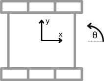

[appa](https://appa.odom.tech/) is a simple and intuitive VEX chassis movement library for [PROS](https://pros.cs.purdue.edu/). 

The intent of this library it to make chassis movement both intuitive to use and understand. Only recommended configurations are supported, but it is designed to be easy to build upon for custom implementations. 

# Features
- **Odometry Position Tracking** – Using combinations of tracking wheels and IMUs to estimate position.
- **Turning** – Supports turning to a specific heading or facing a target point.
- **Movements** – Allows movement by a relative distance, to a specific point, or to a pose.
- **Path Following** – Follow a pre-defined path using pure pursuit.
- **Customizable Parameters** - All movement parameters are fully customizable, designed for readability and ease of use.
- **Flexible Control** – Has many options including asynchronous movements and custom lambda exit conditions.

# Installation

1. Download the most recent version with `pros c add-depot appa https://appa.odom.tech/appa.json`

2. Apply the library to your project with `pros c apply appa`

3. Add `#include "appa/appa.h"` in your `main.h`


# Usage
This library is comprised of two main components: odometry for position tracking and a chassis for robot movement.

## Odometry
[Odometry](http://thepilons.ca/wp-content/uploads/2018/10/Tracking.pdf) is used for keeping track of the robots position at all times. The two supported configurations are: two tracker wheels, one in the x and one in the y direction, in combination with an IMU; and three tracker wheels, two parallel in the x direction and one in the y direction. Here is how to create an instance of odom:
```cpp
appa::Tracker tracker({2, 3},  // x encoder
                      {2, 1},  // y encoder
                      {13, 5}, // imus
                      321.5);  // tpu (ticks per inch)

appa::Odom odom(tracker, // tracker
                {2, 0},  // linear offset (inches)
                45);     // angular offset (degrees)
```

- The tracker encoder ports can be `port` or `{expander port, port}`. Negative port reverses the direction.
- The imu port can be `port` or `{port1, port2, ...}` for averaging multiple imus.
- TPU should be experimentally determined by moving the robot a known distance and recording the encoder output `ticks / distance`. The distance can be in any unit you choose, but must stay consistent throughout all of your code. Most often inches.
- The linear offset is `{x, y}` how much to offset your tracking center, e.g. if you want it to be at your center of mass.
- The angular offset can be used for [angled tracker wheel](https://youtu.be/TqMNuXfKgMc?si=iwc8nQkSW-A0ZFeG&t=36) configurations, as long as the wheels are perpendicular.

To start odometry, simply call `odom.start()`, usually during initialization.

```cpp
void initialize() {
    odom.start();
}
```

Odometry will do its work in the background after you start it, and should be passed into a chassis to use it. Here are some useful commands:

```cpp
// set the robot's pose
odom.set(24, 12, 90);
// get the robot's pose
Pose p = odom.get();
// set the tracking offset (e.g. if COG changes)
// note: this doesn't change tracking, just the .get() function (used in movements)
odom.set_offset({5, 0});
// print useful odometry information to the terminal
odom.debug = true;
```

## Chassis
The chassis is whats used to control the robot. Only differential drive robots are supported in this library. Most holonomic drives will work fine, but won't take advantage of its capabilities. The chassis contains configurations for the different movement types as well as optional options. Information on tuning a PID can be found [here](https://wiki.purduesigbots.com/software/control-algorithms/pid-controller). Here is how to make a chassis:

```cpp
appa::Config config(100,              // speed (%)
                    500,              // accel (%/s)
                    {12, 0, 1},       // linear PID
                    {120, 5, 10},     // angular PID
                    0.5,              // lead (%)
                    6.0,              // lookahead (in)
                    0.5,              // linear exit (in)
                    1.0,              // angular exit (deg)
                    6.0,              // angular deadzone (in)
                    {0.05, 0.1, 250}, // exit speed (in, deg, ms)
                    50,               // settle (ms)
                    0);               // timeout (ms)

appa::Chassis bot({-10, -9, 8, 3, -1},    // left motors
                  {17, 19, -18, -12, 11}, // right motors
                  odom,                   // odom
                  config);                // configuration
```
- Config is used to set all the required and default movement parameters. These are explained in more detail below.
- Left and Right motors are provided in a list. Negative reverses the motor direction.

### Options & Parameters
Options contain different parameters for a chassis movement. The purpose of options are to make it very easy and readable to modify any chassis movement, allowing highly customizable autonomous programs. They are, as the name implies, optional and can be used to overwrite the default parameters defined in the configuration.

They can be set by simply putting the variable name and value in brackets like `{.speed = 100}`. You can set as many options as you want separated by commas, but **they must be in the same order as the list below**. Options can also easily be combined using the `<<` and `>>` operators. For example, `opts1 << opts2` will overwrite options in `opts1` with any set in `opts2`. If `opts2` is empty, the the resulting options will be equal to `opts1`. Options are as follows:

| Option | Description | Default | Units |
| - | - | - | - |
| `Direction dir` | The direction of the movement. | `AUTO` for move, `FORWARD` for turns and follow | `AUTO`, `FORWARD`, or `REVERSE` |
| `Direction turn` | The rotating direction of a turn | `AUTO` | `AUTO`, `CCW`, or `CW` |
| `bool thru` | `true` for through movement | `false` | - |
| `bool relative` | `true` for relative movement | `false` | - |
| `bool async` | `true` for asynchronous movement | `false` | - |
| `double speed` | The maximum speed of a movement | `config.speed` | % of max voltage |
| `double accel` | The maximum acceleration of a movement | `0` or ignore acceleration limits | Speed (%) per second |
| `Gains lin_PID` | PID gains for linear movement | `config.lin_PID` | - |
| `Gains ang_PID` | PID gains for angular movement and turns | `config.ang_PID` | - |
| `double lead` | The lead percentage for boomerang movements | `config.lead` | Decimal % of distance to target |
| `double lookahead` | The lookahead distance for pure pursuit movements | `config.lookahead` | Linear units |
| `double offset` | The offset distance from a move target | `0` | Linear units |
| `double lin_exit` | The maximum linear error to be considered at target | `config.lin_exit` | Linear units |
| `double ang_exit` | The maximum angular error to be considered at target | `config.ang_exit` | Degrees |
| `double ang_dz` | The minimum linear error to enable the angular component | `config.ang_dz` | Linear units |
| `ExitSpeed exit_speed` | The minimum speeds to exit a movement | `config.exit_speed` | Linear/Degrees/ms |
| `int settle` | The time for a movement to stay in target to be considered completed | `0` | Milliseconds |
| `int timeout` | The maximum allowed time for a movement | `0` or ignore timeout | Milliseconds |
| `function<bool()> exit_fn` | custom exit with lambda function | `nullptr` | - |

<!-- | Parameter            | point | pose | path | turn |
|----------------------|-------|------|------|------|
| `Direction dir`       |   X   |   X  |   X  |   X  |
| `Direction turn`      |       |      |      |   X  |
| `bool thru`           |   X   |   X  |   X  |   X  |
| `bool relative`       |   X   |   X  |   X  |   X  |
| `bool async`          |   X   |   X  |   X  |   X  |
| `double speed`        |   X   |   X  |   X  |   X  |
| `double accel`        |   X   |   X  |   X  |   X  |
| `Gains lin_PID`       |   X   |   X  |   X  |      |
| `Gains ang_PID`       |   X   |   X  |   X  |   X  |
| `double lead`         |       |   X  |   L  |      |
| `double lookahead`    |       |      |   X  |      |
| `double offset`       |   X   |   X  |   L  |      |
| `double lin_exit`     |   X   |   X  |   L  |      |
| `double ang_exit`     |       |   X  |   L  |   X  |
| `double ang_dz`       |       |   X  |   L  |   X  |
| `ExitSpeed exit_speed`|   X   |   X  |   X  |   X  |
| `int settle`          |   X   |   X  |   L  |   X  |
| `int timeout`         |   X   |   X  |   X  |   X  |
| `std::function<bool()> exit_fn` | X   |   X  |   X  |   X  | -->

### Movements
Currently, there are 3 different motion commands: `move(target, options, overwrite)`, `turn(target, options, overwrite)`, and `follow(path, options, overwrite)`. This makes it very easy to control the chassis. `move` targets can be a single number for a relative straight movement, a point to drive to, or a target pose which uses the boomerang controller. `turn` targets can be a single number for a target heading, or a point to face towards. `follow` targets must be a vector of points. Options will be set as `options << overwrite` for the purpose of allowing the user to use a set of predefined options, and also manually set others for a specific movement. The movement parameters will automatically default to configurations or default options for those not specified. Movements can be done like:

```cpp
std::vector<appa::Point> path1 = {{24, 0}, {24, 24}, {0, 24}, {0, 0}}; // path with 4 points

bot.move(-10);                                     // move backwards 10 units (inches)
bot.move({24, 0, 90});                             // move to pose {24, 0, 90}
bot.move({24, 24}, {.async = true, .speed = 100}); // move to point {24, 24} asynchronously at max speed
bot.turn({0, 0}, {.dir = REVERSE});                // turn so the rear faces {0, 0}
bot.turn(180, {.turn = CCW, .relative = true});    // turn 180 degrees CCW, relatively
bot.follow(path1, {.lookahead = 4});               // follow path1 with a lookahead distance of 4in
```

Options also make it very easy to tune specific types of motions and use them throughout your autonomous.

```cpp
// preset and tuned options
appa::Options thru = {.thru = true, .lin_exit = 4};
appa::Options fast = {.speed = 100, .accel = 500};
appa::Options precise = {.speed = 50, .accel = 50, .lin_PID = appa::Gains{5, 0, 1}};
appa::Options goal_grab = {.exit_fn = [] { return claw.has_goal(); }};

bot.move({24, 12});                            // move with default options
bot.move({50, 10}, fast << thru);              // move with thru and fast options
bot.move({60, 0}, fast << goal_grab);          // move fast and exit when claw has goal
bot.move({10, 0, 90}, precise, {.lead = 0.7}); // move with precise options plus different lead
bot.turn(90, fast);                            // turn with fast options
```

For operator control, tank and arcade controls exist. You can pass in the controller for ease of use, or simply use numbers for custom curves.

```cpp
void opcontrol() {
    pros::Controller master(CONTROLLER_MASTER);

    while(true) {
        bot.arcade(master); // arcade controls
        bot.tank(master);   // tank controls
    }
}
```

Please go through the headers files in `include/appa/` to see all available functions. Other useful chassis commands include:

```cpp
bot.wait();                           // wait for async movement to stop
bot.set_brake_mode(MOTOR_BRAKE_HOLD); // set the brake mode
bot.stop();                           // stop moving
```

### Coordinate System:


# Customization
Although using one of the two supported odometry tracking configurations is recommended, you may want to use your own implementation or an entirely different method of localization. Appa is designed in a way to make doing this easy.

## Custom Localizer
When creating a `Chassis`, it takes in a `Localization` object and uses only the `Pose get();` function to retreive the current position. If you want to implement your own localization system, simply create a subclass derived from the `Localization` class and override the `get()` function like this:
```cpp
class YourLocalizer : public Localization {
    appa::Pose get() const override;
}
```
Then just implement the get function however you need so it returns a `Pose`.

## Custom Odometry Tracking Configuration
